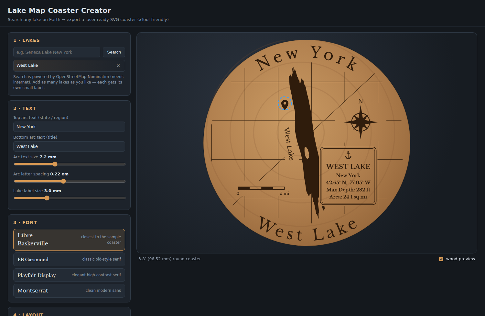

# Lake Map Coaster Creator

A small web app that turns **any lake (or group of lakes) on Earth** into a
**laser-ready SVG coaster design** — like the classic engraved Finger Lakes
coaster: real lake shapes in the middle, small labels beside each lake, the
state curved along the top and the title curved along the bottom.



## Features

- **Real lake outlines** — search any lake worldwide via OpenStreetMap
  (Nominatim). Add as many lakes as you want on one coaster; islands inside
  lakes are preserved as un-engraved holes. Outlines are fetched at a
  resolution matched to the lake's size (a Great Lake arrives shoreline-
  accurate but manageable; a pond keeps full detail).
- **Shoreline smoothing** — a proper low-pass filter (uniform resample +
  Gaussian, then simplification), not just point-dropping. Slider up =
  smoother: intricate island fields and fjord-y shorelines melt into the
  clean silhouettes that look right engraved on wood.
- **Curved (arc) text** on top and bottom, with adjustable size and
  letter-spacing, just like the sample coaster.
- **Small labels next to each lake**, auto-placed along each lake's long axis
  (PCA) — then drag to move, click to edit text/size/angle. Any label can
  instead be **boxed**: a rounded-corner text box reversed out of the lake
  fill (an un-engraved window with an engraved border and the name inside),
  for putting the lake's name *inside* the lake.
- **Streets around the lake** (optional, for single small lakes): loads real
  road data from OpenStreetMap Overpass for the visible area, with separate
  include/exclude toggles for **highways**, **main roads**, **local streets**,
  and **service roads & paths**, plus a line-width control. Streets are
  geometrically clipped to the coaster disc and kept out of the arc-text
  bands (no SVG clip-paths — laser software gets plain pre-cut polylines).
- **Location pins**: drop one or more classic map pins (tip = the spot) to
  mark where someone lives, the family cabin, a proposal spot… drag to
  position; the pin engraves solid with a knocked-out center dot.
- **Scale bar in miles** — a substantial checkered (USGS-style) bar with
  “0” and value labels, true to the map scale (Mercator, cos-latitude
  corrected), picking a round value (e.g. “5 mi”, or feet for tiny ponds) and
  staying accurate as you zoom. A **size slider** scales it up or down —
  bigger settings represent a longer round distance — and you can either
  leave it free-floating (draggable) or **integrate it into the info box**.
- **Nautical compass rose** — classic 8-point rose with ring and “N”,
  toggleable with a size slider, draggable, and it rotates with the map so
  north stays true.
- **Lake info box** (single-lake designs) — a plaque topped with a proper
  admiralty **anchor** emblem (built by unioning the shank, stock, arms and
  flukes into one clean silhouette), double border, and **bold** text for:
  lake name, state/region, center coordinates, max depth and area in square
  miles. The bold is a **real bold cut** of the chosen family (never a
  synthesized weight), so every glyph is a single clean contour that engraves
  once. Area is measured from the actual
  outline; depth auto-fills from OpenStreetMap tags or Wikidata when
  available, and both fields are freely editable. Where the plaque overlaps
  the lake, a clean window is carved out of the fill (true polygon boolean,
  not a clip-path).
- **Snap to grid** — an optional toggle; when on, dragging any piece (info
  box, compass, scale bar, labels, pins) snaps to a grid, with guide dots
  shown on the preview so alignment is easy. Turn it off for free placement.
- Streets automatically clip around all text windows, labels, the compass,
  and the scale bar, so nothing engraves on top of anything else.
- **Four fonts** (bundled, no internet needed for rendering):
  - *Libre Baskerville* — closest to the sample coaster's engraved serif
  - *EB Garamond* (weight 500) — classic old-style serif
  - *Playfair Display* — elegant high-contrast serif
  - *Montserrat* (weight 500) — clean modern sans
- **Laser-first SVG export** (defaults sized for a **3.8″ / 96.52 mm** round
  coaster, diameter adjustable):
  - true physical size: `width/height` in **mm** with a matching viewBox
    (1 SVG unit = 1 mm)
  - **all text converted to vector paths** — no `<text>` elements, so no
    font-substitution surprises in xTool Creative Space
  - flat structure: no transforms, no clip paths, no CSS, no rasters
  - color-separated layers: **black fills = engrave**, **blue lines =
    streets** (set to Score, or Engrave for bolder roads), **red 0.1 mm
    stroke circle = cut** (easy to select-by-color in XCS/LightBurn)
  - polygons simplified to a configurable tolerance and tiny slivers/islands
    filtered, so files stay clean and engrave crisply
  - lakes use `fill-rule="evenodd"` **and** opposite ring winding, so island
    holes survive both even-odd and non-zero renderers

## Using it

It's a static site — no build step.

```bash
# from the repo root
python3 -m http.server 8000
# then open http://localhost:8000
```

(Or host it on GitHub Pages: Settings → Pages → deploy from branch, root `/`.)

1. **Search** a lake (include the region for better hits: “Keuka Lake New York”),
   click a result to add it. Repeat for each lake you want.
2. The **top text** auto-fills with the state/region; type your own top and
   bottom titles any time.
3. Pick a **font**, tweak arc size/letter-spacing, drag lakes (pan), scroll to
   zoom, drag labels, click a label to edit its text/size/angle.
4. **Download SVG** and import it into xTool Creative Space.

> Lake search calls `nominatim.openstreetmap.org` from your browser, so using
> the app needs internet; fonts and export are fully local.

## Importing into xTool Creative Space (XCS)

1. **File → Import** (or drag the SVG onto the canvas).
2. Check the size: the design should come in at **96.5 × 96.5 mm** (3.8″). If
   your XCS version ignores physical units, set width/height to 96.52 mm —
   everything scales together.
3. Select the **black** artwork → set processing type **Engrave** (fill). For
   crisp small labels use 250–350 DPI (lines-per-cm equivalent) and test power
   on scrap first.
4. If you included streets, select the **blue** lines → set to **Score**
   (vector engrave) for fine crisp roads, or Engrave with a small power for a
   softer look.
5. Select the **red circle** → set to **Cut** if you're cutting your own
   blanks, or **Ignore/delete** it if you're engraving a pre-made coaster (use
   it as a positioning reference before deleting).
6. Engraving the top face needs **no mirroring**.

Small-text tip: at 3.8″ the lake labels default to ~3 mm — that engraves well
on hardwood at fine DPI. Below ~2 mm caps the app warns you, because char
detail starts to blur into the burn.

## Repo layout

```
index.html          app UI
css/style.css
js/app.js           projection, geometry, smoothing, arc-text layout, export
js/fonts-data.js    bundled fonts (base64 TTF, generated — see fonts/README.md)
js/fonts-bold-data.js  bold cuts for the info box (subset, generated)
js/vendor/          opentype.js 1.3.4 (MIT), polygon-clipping 0.15 (MIT)
fonts/              font licenses (SIL OFL 1.1) + regeneration notes
tools/e2e-test.mjs  Playwright smoke test of the whole pipeline
```

### Development / testing

```bash
npm install          # installs playwright (dev only)
npm test             # runs tools/e2e-test.mjs against a local server
```

## Data & attribution

- Lake geometry and search results **© OpenStreetMap contributors**, licensed
  [ODbL](https://www.openstreetmap.org/copyright). If you sell engraved items
  made from these maps, credit “Map data © OpenStreetMap contributors” on the
  listing or packaging.
- Depth data (when auto-filled) may come from
  [Wikidata](https://www.wikidata.org) (CC0).
- Fonts under the SIL Open Font License 1.1 (see `fonts/`).
- `opentype.js` and `polygon-clipping` under MIT (see `js/vendor/`).
